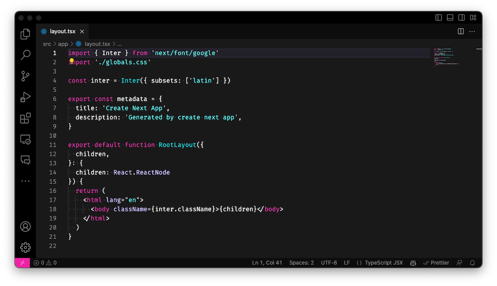

<div align="center">
  
  <h1 align="center">Tonight Theme</h1>
  <p>A Tonight Theme for Visual Studio Code.</p>
  
</div>

## Installation

You can easily install the **Tonight Theme** from the [Visual Studio Code Marketplace](https://marketplace.visualstudio.com/items?itemName=thisisclick.tonight-vscode-theme).

## Recommendations

To enhance your coding experience with the **Tonight Theme** in Visual Studio Code, we recommend adding the following settings to your `settings.json` file:

```json
{
  "editor.fontFamily": "Fira Code",
  "editor.fontLigatures": true,
  "editor.fontSize": 14
}
```

You can download the **Fira Code Font** from [Github](https://github.com/tonsky/FiraCode) to use with the theme.

## Contributions

We welcome contributions to make the **Tonight Theme** even better! If you have discovered any issues or would like to propose improvements, please refer to our [Contribution Guidelines](CONTRIBUTING.md) for detailed instructions.

## License

The **Tonight Theme** is licensed under the [MIT License](LICENSE).
